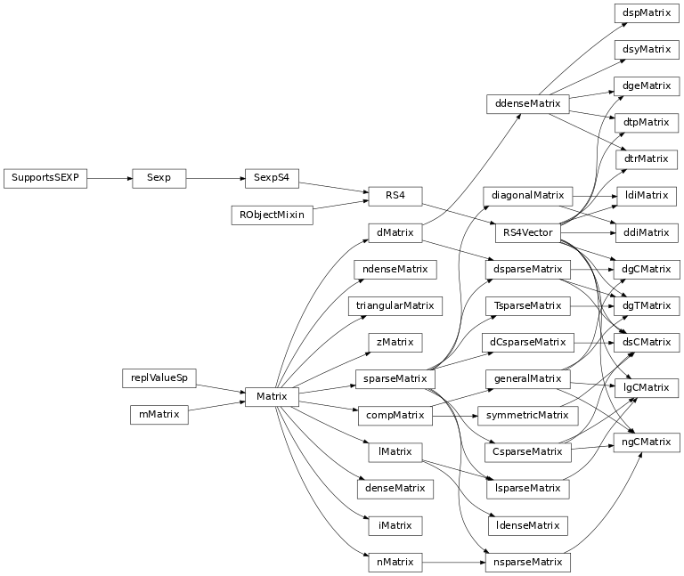

# Mapping the R package Matrix

[](https://travis-ci.com/rpy2/rpy2-Matrix)

This Python package is an extension to `rpy2` mapping the R package `Matrix`.

The R package is a rather complex hierarchy of classes, some of which are already mirrored (along with the hierarchy, as shown here):



To install from the Github repository:

```bash
pip install git+https://github.com/rpy2/rpy2-Matrix#egg=rpy2-Matrix
```

At the time of writing, documentation is only in docstrings, and as examples in the [unit tests](rpy2_Matrix/tests).
